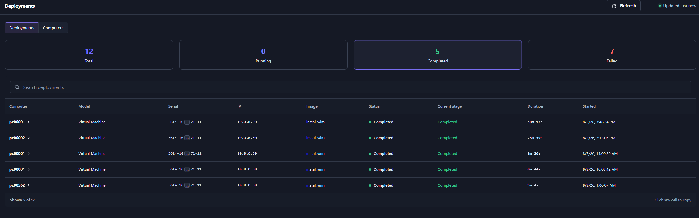
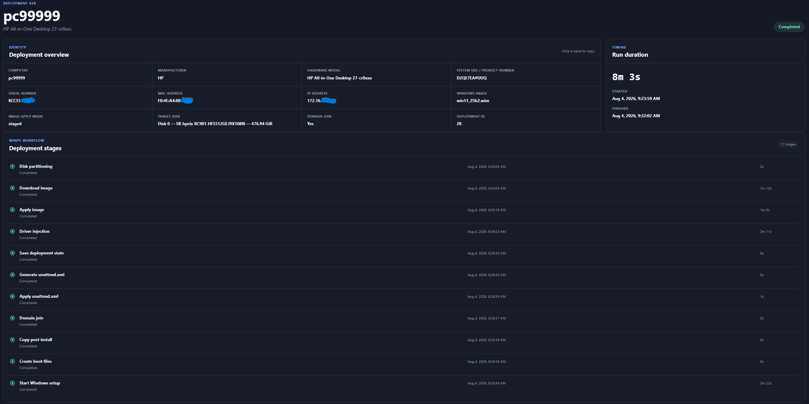
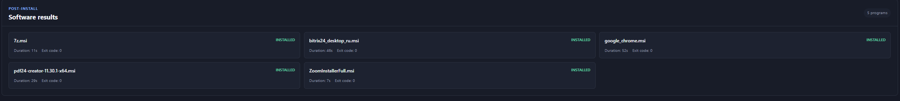
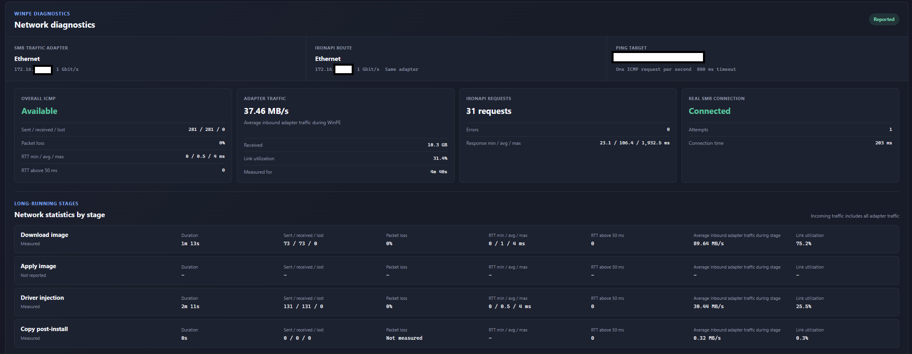
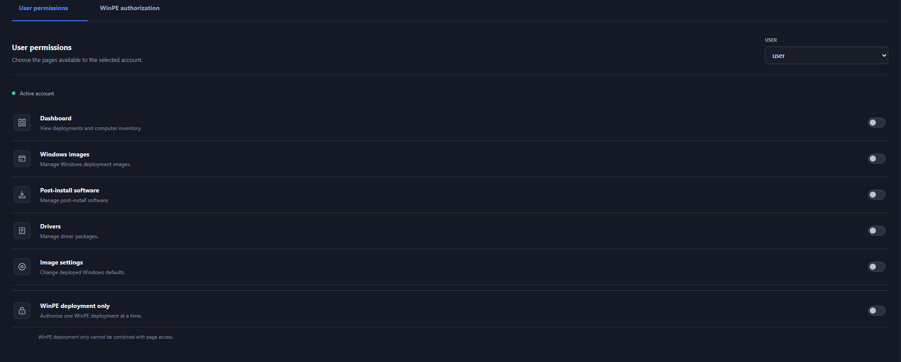
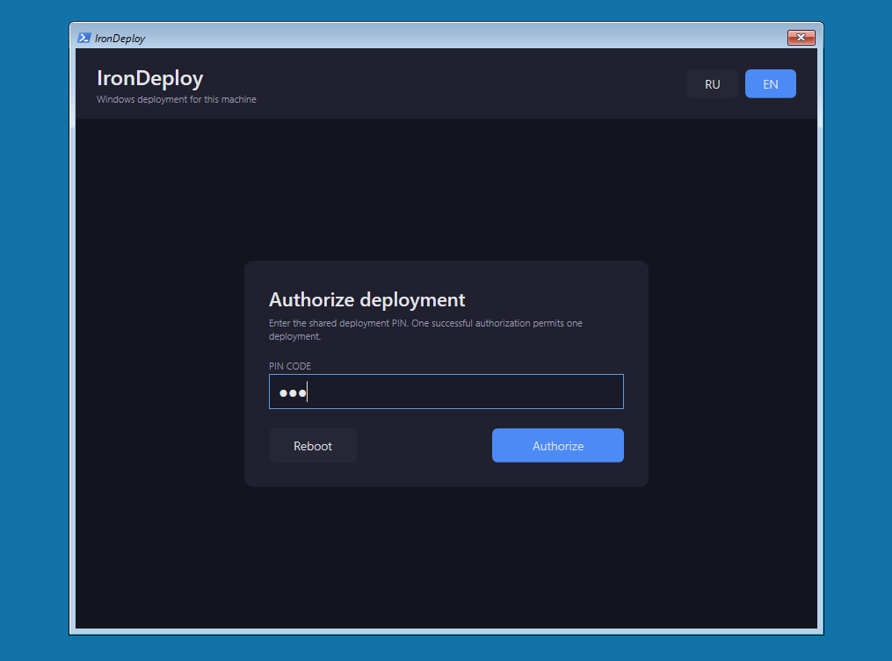
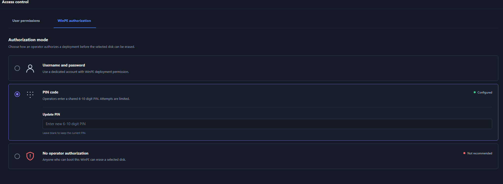
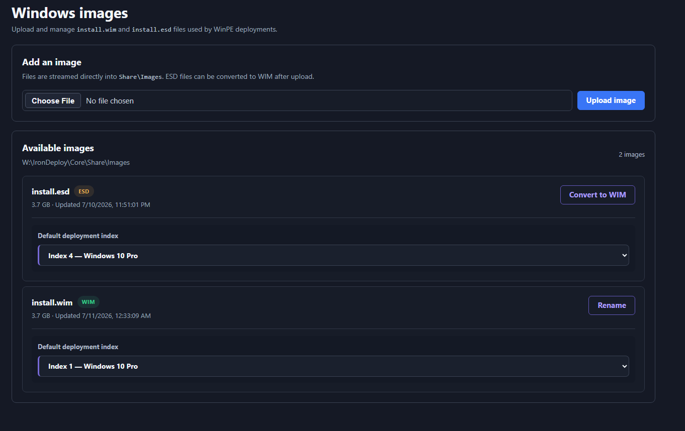
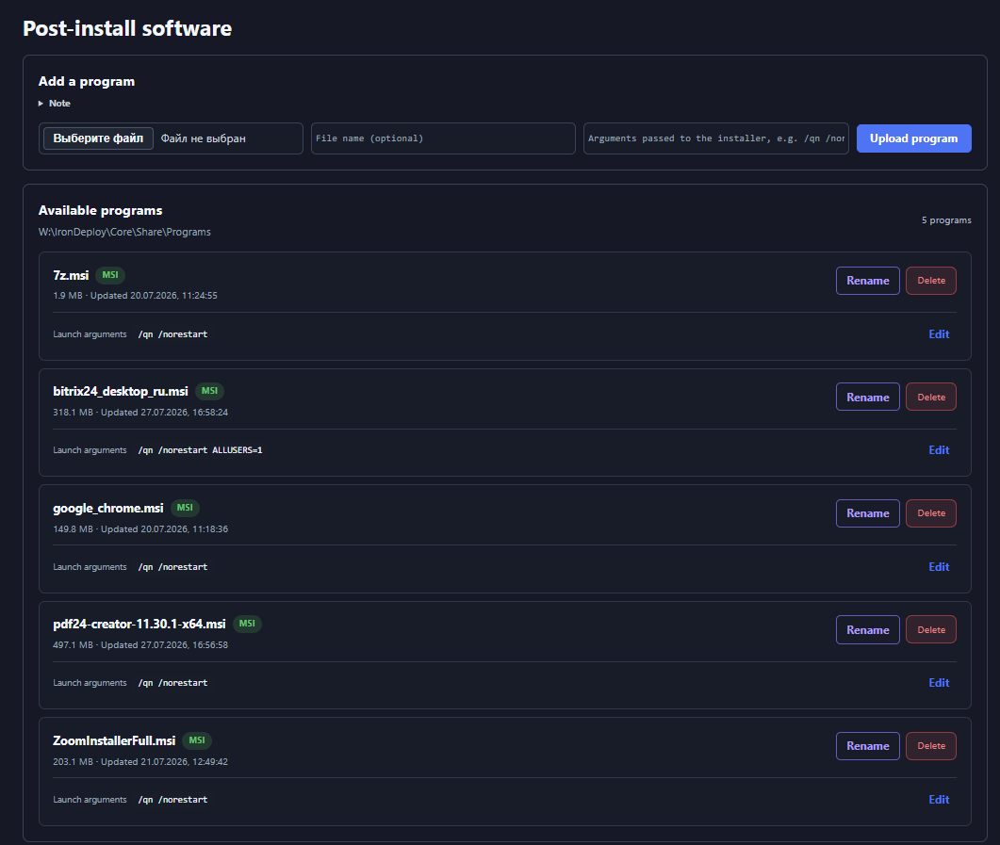

# IronDeploy

> **Alpha software.** Test IronDeploy on a virtual machine or disposable computer
> before using it on production hardware. The WinPE workflow permanently erases
> the physical disk explicitly selected by the operator.

IronDeploy is an independent Windows deployment tool for installing Windows 10
and Windows 11 from WinPE.

It covers the bare-metal deployment part of what the Microsoft Deployment
Toolkit does, without the surrounding toolchain: one operator-facing WinPE
interface, one API, and a plain SMB share for payloads.

It performs a complete deployment from a Windows installation image. You can
use WIM or ESD directly, but WIM is recommended for regular deployment;
IronDeploy can convert an imported ESD image to WIM. It does **not** capture or
clone an already configured reference computer.

## What IronDeploy does

From its graphical WinPE interface, an operator can:

- choose a Windows image and edition;
- choose the target physical disk after reviewing its number, model, and size;
- choose optional post-install programs;
- select one driver package for the detected hardware, or skip drivers;
- let IronAPI suggest the next available computer name from the configured
  sequence, for example `PC00001`, `PC00002`, and show names previously used
  by the same hardware;
- optionally join the installed computer to Active Directory through Offline
  Domain Join;
- follow deployment progress and review the final result in the IronAPI
  dashboard.


During deployment IronDeploy partitions the selected disk, applies the selected
Windows image, injects offline drivers, writes the Windows answer file,
optionally applies Offline Domain Join, stages selected programs, and boots
into the newly installed operating system. Post-install tasks then install the
selected software and report their results to IronAPI.

The server-owned deployment configuration selects how WinPE obtains Windows
images and driver packages. New installations default both strategies to
`staged`. A staged image is copied to the selected local disk, verified by
SHA-256, and then passed to DISM; staged drivers are copied and checked locally
before injection. `direct` remains available when DISM should read the content
from SMB. IronAPI sends both choices in the existing per-deployment manifest;
they are not embedded in the WinPE image.

### Deployment dashboard

The dashboard summarizes deployment outcomes and keeps recent runs searchable
by computer, hardware, image, status, stage, and start time.



Selecting a run opens its deployment overview, stage timings, and final
post-install software results.





Once a deployment ID is registered, WinPE reports the negotiated API and SMB
adapter link speeds before disk partitioning. Deployment details can therefore
show whether the path negotiated at 100 Mbps or 1 Gbps even before the final
network-diagnostics report is available. The WPF deployment log always shows
the detected speed and highlights links below 1 Gbps as warnings.



## Prerequisites

Install these Microsoft components on the deployment server:

- [Windows Assessment and Deployment Kit (Windows ADK)](https://learn.microsoft.com/en-us/windows-hardware/get-started/adk-install)
- [Windows PE add-on for the Windows ADK](https://learn.microsoft.com/en-us/windows-hardware/manufacture/desktop/download-winpe--windows-pe)

You also need:

- Windows PowerShell 5.1;
- Python 3.11.7 (supported); Python 3.14.7 has passed the current test suite
  and setup-flow checks and is considered provisionally compatible pending
  broader production validation;
- a way to boot the generated x64 WinPE image, such as WDS/PXE, ISO, or USB.

IronDeploy does not redistribute Windows ADK, WinPE, Windows installation
images, or Windows licences.

## Installation

Download or clone the repository, open an elevated Windows PowerShell session
in its root, and run scripts 1 through 5 in order. Script 6 is an optional
maintenance utility and is not part of installation.

### 1. Prepare the WinPE working tree

```powershell
& ".\1. Prepare-IronDeployWinPE.ps1"
```

Initializes the WinPE working tree. It does not rebuild the WIM or ISO.

### 2. Prepare IronAPI

```powershell
& ".\2. Prepare-IronAPI.ps1"
```

Creates the IronAPI Python virtual environment when needed and installs its
dependencies.

### 3. Configure IronDeploy

```powershell
& ".\3. Start-IronDeploySetupWeb.ps1"
```

Starts the local SetupWeb configuration page. Configure IronAPI, the SMB share,
Active Directory connection settings, WinPE access, and the first
administrator account.

After IronAPI is available, configure the allowed computer-name formats under
`/image-config` in **WinPE interface → Computer naming**.

After saving, finish setup in the browser so SetupWeb closes automatically.
Alternatively, you may stop it with `Ctrl+C`.

### 4. Test IronAPI in the foreground

```powershell
& ".\4. Start-IronAPI.ps1"
```

Starts IronAPI in the current console. Verify that it starts correctly, then
stop it with `Ctrl+C`.

### 5. Install the IronAPI Windows service

```powershell
& ".\5. Install-IronAPIService.ps1"
```

Installs IronAPI as an automatically started Windows service under a dedicated
account that you provide. Choose a domain account when Active Directory
integration or Offline Domain Join is used, or an existing local account for
deployments without Active Directory. The account must already exist.
Built-in identities such as `LocalSystem`, and administrator accounts, are
rejected.

### Optional maintenance: remove the Windows service

Script 6 is not part of installation. Use it only when the IronAPI service must
be stopped and unregistered, for example before moving IronDeploy to another
host or changing the service identity from scratch:

```powershell
& ".\6. Delete-IronAPIService.ps1"
```

It removes only the service registration. Configuration, the database, images,
drivers, programs, Offline Domain Join blobs, logs, and repository files are
preserved, so step 5 can register the service again at any time.

### Required accounts and file access

Before the first deployment:

- publish only `Core\Share` as an SMB share; do not share the repository root;
- create a separate local or domain SMB account for WinPE. Grant it read-only
  access in both the SMB share permissions and the NTFS permissions. Do not
  grant write, change, full-control, local administrator, or interactive logon
  rights, and do not reuse the IronAPI service identity;
- protect the entire local IronDeploy repository directory with NTFS
  permissions. Allow access only to administrators, the IronAPI service
  identity, and operators who maintain the deployment system;
- run IronAPI under a dedicated identity created only for it, never a built-in
  or administrator account. With Active Directory integration enabled this must
  be a domain account: grant it read/search access to computer objects for name
  checks and only the delegated rights required to create or provision computer
  accounts for Offline Domain Join in the intended OU. It does not need Domain
  Admin membership. Without Active Directory, a dedicated local account is
  enough; leave the directory settings empty in SetupWeb, which disables LDAP
  name checks and Offline Domain Join.

### Access control

Administrators can grant each account access only to the IronAPI pages it needs,
or create an account limited to authorizing a single WinPE deployment.



WinPE authorization can require a dedicated username and password or a shared
PIN. Disabling operator authorization is available for isolated test setups but
is not recommended.





After installation, use the IronAPI web interface to manage Windows images,
driver packages, programs, and deployment settings, and to build the current
WinPE WIM or ISO.

### Managing Windows images

The Windows images page accepts WIM and ESD files, lets administrators choose a
default deployment edition, and can convert imported ESD images to WIM.



### Managing post-install programs

The post-install software page lets administrators upload installers, configure
their unattended launch arguments, and maintain the programs offered to WinPE
operators during deployment.



## Security must-haves

IronDeploy handles deployment tokens, SMB credentials, Active Directory
operations, and destructive disk actions. Before using it outside a test
environment:

- use SMB 3.x and require **SMB signing** so files cannot be silently modified
  in transit. Run the following command in an elevated PowerShell session on
  the SMB server; it requires signing for all shares hosted by that server:

  ```powershell
  Set-SmbServerConfiguration -RequireSecuritySignature $true -Force
  ```

- prefer HTTPS for IronAPI and enable certificate validation, because the API
  carries deployment tokens and the configured SMB account details;
- never commit `.env`, databases, ODJ blobs, WIM/ESD images, generated
  WIM/ISO files, driver packages, or program installers;
- verify the target machine and the selected disk's number, model, and size
  before confirming the permanent erase.

SMB encryption is optional. It hides file contents in transit but may reduce
deployment speed; SMB signing is the minimum recommended integrity protection.

## Current Alpha limitations

- the deployment runtime targets x64 UEFI/GPT systems;
- the selected disk is fully erased and repartitioned; existing partitions are
  not yet previewed in WinPE;
- ESD images can be deployed directly, but WIM is recommended for regular use;
- hardware, firmware, network, drivers, and Windows images vary, so validate the
  complete workflow in your own environment;
- only the latest release is supported.

## Documentation

Detailed implementation and operator notes live outside this README:

- [Architecture](Core/Docs/ARCHITECTURE.md)
- [WinPE build and deployment runtime](Core/Docs/WINPE.md)
- [IronAPI configuration and API behaviour](Core/Docs/API.md)
- [Initial configuration with SetupWeb](Core/Docs/SETUPWEB.md)
- [Roadmap](Core/Docs/ROADMAP.md)
- [Security policy](SECURITY.md)
- [Contributing and bug reports](CONTRIBUTING.md)
- [Third-party notices](THIRD_PARTY_NOTICES.md)

## Community

Use [GitHub Discussions](https://github.com/Syrinoxsis/IronDeploy/discussions)
for questions, deployment experiences, feature ideas, and general or commercial
inquiries. Report bugs through GitHub Issues.

Do not report vulnerabilities publicly. Follow the private reporting process in
[SECURITY.md](SECURITY.md).

## License

IronDeploy is licensed under the Apache License, Version 2.0. See
[LICENSE](LICENSE) and [NOTICE](NOTICE).

The interface includes modified icon designs from Lucide Icons and Feather
Icons. Their applicable notices and licence terms are provided in
[THIRD_PARTY_NOTICES.md](THIRD_PARTY_NOTICES.md).
