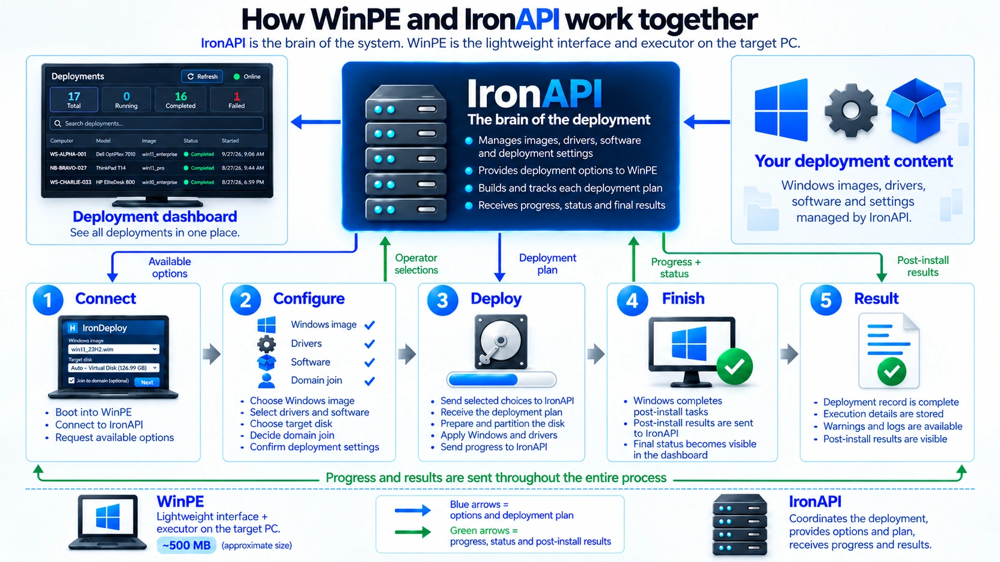

# IronDeploy

**Deploy Windows 10 and Windows 11 to bare-metal PCs through a graphical WinPE interface.**

> [!CAUTION]
> **IronDeploy is Alpha software.** Test it on a virtual machine or disposable
> computer before using it on production hardware. The physical disk selected
> by the operator is permanently erased during deployment.

IronDeploy automates the repetitive work involved in preparing a new or erased
computer. Boot the target PC into IronDeploy WinPE, choose the Windows image,
target disk, drivers, software, computer name, and optional domain join, then
start the deployment.

IronAPI acts as the control centre: it manages the available deployment content,
builds the deployment plan, receives progress throughout the process, and keeps
the final results searchable in a web dashboard. WinPE stays lightweight and
performs the actual deployment on the target computer.



## How it works

1. **Prepare the deployment server**
   Configure IronAPI and add Windows images, driver packages, post-install
   software, custom PowerShell scripts, and deployment settings.

2. **Boot the target computer**
   Start IronDeploy WinPE through WDS/PXE or from USB media. For a virtual
   machine, use the generated ISO.

3. **Choose the deployment**
   Select the Windows image, target disk, drivers, optional software, computer
   name, and whether the computer should join Active Directory.

4. **Deploy Windows**
   IronDeploy prepares the disk, applies the Windows image, injects drivers,
   writes the Windows answer file, applies Offline Domain Join when selected,
   and prepares the system for its first boot.

5. **Complete and review**
   After the first boot, Windows installs the selected software and runs the
   configured PowerShell scripts. Progress, timings, warnings, and final
   results are reported to IronAPI.

## Key features

- Windows 10 and Windows 11 deployment from WinPE;
- WIM and ESD image support, including ESD-to-WIM conversion;
- offline driver injection using centrally managed driver packages;
- unattended post-install software;
- custom PowerShell scripts that run before or after software installation;
- software and PowerShell execution results reported to IronAPI;
- configurable computer-name formats and automatic name suggestions;
- Offline Domain Join for Active Directory environments;
- searchable deployment history, stage timings, warnings, and software results;
- network link-speed and deployment-path diagnostics;
- per-user access control and dedicated WinPE authorization;
- fully on-premises operation.

## Project scope

IronDeploy focuses on deploying Windows to physical computers. It covers the
bare-metal deployment part of tools such as Microsoft Deployment Toolkit without
requiring the surrounding MDT toolchain.

It does **not** capture or clone an already configured reference computer, and it
is not intended to replace every MDT component. IronDeploy uses standard Windows
installation images and applies the selected configuration during deployment.

## Interface overview

### WinPE deployment interface

The operator can review the detected hardware, choose the target physical disk,
select the available deployment options, and follow the current stage.


### Deployment dashboard

The dashboard keeps recent runs searchable by computer, hardware, image, status,
stage, and start time. Each deployment includes stage timings, warnings, network
diagnostics, and post-install software and PowerShell results.


<details>
<summary>More interface screenshots</summary>

#### Deployment details


#### Post-install software results


#### Network diagnostics


#### Access control


</details>

## Prerequisites

Install these Microsoft components on the deployment server:

- [Windows Assessment and Deployment Kit (Windows ADK)](https://learn.microsoft.com/en-us/windows-hardware/get-started/adk-install)
- [Windows PE add-on for the Windows ADK](https://learn.microsoft.com/en-us/windows-hardware/manufacture/desktop/download-winpe--windows-pe)

You also need:

- Windows PowerShell 5.1;
- Python 3.14 (primary tested version: 3.14.7); Python 3.11 is also supported;
- a way to boot the generated x64 WinPE image, such as WDS/PXE, ISO, or USB.

IronDeploy does not redistribute Windows ADK, WinPE, Windows installation images,
or Windows licences.

## Installation

Download or clone the repository and open an elevated Windows PowerShell session
in its root.

Run steps 1 through 3 first. Step 4 provides a complete foreground setup and
test path without installing a Windows service. Continue to step 5 only after a
deployment works correctly in your environment.

### 1. Prepare the WinPE working tree

```powershell
& ".\1. Prepare-IronDeployWinPE.ps1"
```

Initializes the WinPE working tree. It does not rebuild the WIM or ISO.

### 2. Prepare IronAPI

```powershell
& ".\2. Prepare-IronAPI.ps1"
```

Creates the IronAPI Python virtual environment when needed and installs its
dependencies.

### 3. Configure IronDeploy

```powershell
& ".\3. Start-IronDeploySetupWeb.ps1"
```

Starts the local SetupWeb configuration page. Configure IronAPI, Active Directory
integration, WinPE access, and the first administrator account for the IronAPI
web interface.

SetupWeb can also publish the prepared deployment-content folder through SMB and
configure its access with a dedicated action.

### 4. Start, configure, and test IronAPI

```powershell
& ".\4. Start-IronAPI.ps1"
```

Step 4 starts IronAPI in the current PowerShell window without installing a
Windows service. This lets you configure and test the complete deployment flow,
and remove IronDeploy later without leaving a registered service behind.

Keep IronAPI running and sign in to its web interface. Then:

1. Configure the allowed computer-name formats.
2. Add the Windows images you need.
3. Add driver packages and post-install software.
4. Add any custom PowerShell scripts.
5. Review the remaining deployment settings.
6. Build the WinPE WIM or ISO from the Image configuration page.
7. Boot the generated WinPE on a virtual machine or test computer and verify the
   complete deployment flow.

The generated artifacts are stored in `Core\dist`:

- `Core\dist\IronDeploy_PE.wim`;
- `Core\dist\IronDeploy_PE.iso`.

Building WinPE requires local administrator rights on the deployment server.
Windows DISM needs these rights to mount and service the WIM, so PowerShell and
the IronAPI process started from it must be elevated.

Local administrator rights do not replace Active Directory permissions. When
testing computer-name availability or Offline Domain Join, the Windows account
running step 4 must also have the required delegated permissions in the target
domain and OU. Domain Admin membership is not required.

After testing, stop IronAPI with `Ctrl+C`.

### 5. Install the IronAPI Windows service

```powershell
& ".\5. Install-IronAPIService.ps1"
```

After a successful test deployment, installs IronAPI as an automatically started
Windows service under an existing dedicated account.

- Use a domain account when Active Directory name checks or Offline Domain Join
  are enabled.
- Use a dedicated local account when Active Directory integration is disabled.

Built-in service identities and the built-in Administrator account are rejected.
Use an account created specifically for IronAPI.

Add the IronAPI service account to the local Administrators group on the
deployment server. Local administrator rights are required for DISM and for
building WinPE through the web interface.

When Active Directory is enabled, separately delegate the permissions needed to
read and check computer names and to create or reuse computer objects in the
intended OU. Domain Admin membership is not required.

The IronAPI service account therefore needs:

- local administrator rights on the IronDeploy server for WinPE builds;
- limited delegated Active Directory permissions for computer-name checks and
  Offline Domain Join;
- no Domain Admin membership.

### Optional: remove the Windows service

```powershell
& ".\6. Delete-IronAPIService.ps1"
```

This removes only the service registration. Configuration, the database,
deployment content, logs, and repository files are preserved.

## After installation

The IronAPI service runs in the background and provides the same web interface
for managing:

- Windows images;
- driver packages;
- software;
- custom PowerShell scripts;
- WinPE settings;
- users and permissions;
- active and completed deployments.

New WIM and ISO artifacts can be built through the web interface at any time.
The service does not need to be stopped and step 4 does not need to be started
again.

Normal IronDeploy installation and maintenance use the numbered scripts 1
through 6 and the web interface. Users do not need to run internal PowerShell
scripts from `Core\Tools`.

See [WinPE build and deployment runtime](Core/Docs/WINPE.md) for details about
WinPE and the deployment process.

## Before the first deployment

- The SMB account configured in SetupWeb for WinPE deployment-content access
  must be a separate read-only account. Do not grant it write, change, local
  administrator, or interactive logon rights.
- Run IronAPI under a dedicated identity. Do not reuse the WinPE SMB account.
- When Active Directory is enabled, delegate only the read and computer-account
  permissions required in the intended OU. Domain Admin membership is not
  required.
- Protect the local IronDeploy repository with NTFS permissions so only
  administrators, the IronAPI service identity, and authorized maintainers can
  access it.

## Security essentials

IronDeploy handles deployment tokens, SMB credentials, Active Directory
operations, and destructive disk actions. Before using it outside a test
environment:

- use SMB 3.x and require **SMB signing**;
- prefer HTTPS for IronAPI and enable certificate validation;
- use separate identities for IronAPI and WinPE file access;
- grant the IronAPI service account local administrator rights only on the
  deployment server;
- do not add the IronAPI service account to Domain Admins; delegate only the
  required permissions in the target OU;
- never commit `.env`, databases, ODJ blobs, Windows images, generated WIM/ISO
  files, driver packages, or program installers;
- verify the target machine and the selected disk's number, model, and size
  before confirming the permanent erase.

Require SMB signing on the SMB server from an elevated PowerShell session:

```powershell
Set-SmbServerConfiguration -RequireSecuritySignature $true -Force
```

SMB encryption is optional. It hides file contents in transit but may reduce
deployment speed; SMB signing is the minimum recommended integrity protection.

See [SECURITY.md](SECURITY.md) for vulnerability reporting and additional
security guidance.

## Current Alpha limitations

- the deployment runtime targets x64 UEFI/GPT systems;
- the selected disk is fully erased and repartitioned;
- existing partitions are not yet previewed in WinPE;
- ESD images can be deployed directly, but WIM is recommended for regular use;
- hardware, firmware, networks, drivers, and Windows images vary, so the complete
  workflow must be validated in your own environment;
- during Alpha, only the latest version on the default branch is supported.

## Documentation

- [Architecture](Core/Docs/ARCHITECTURE.md)
- [WinPE build and deployment runtime](Core/Docs/WINPE.md)
- [IronAPI configuration and API behaviour](Core/Docs/API.md)
- [Initial configuration with SetupWeb](Core/Docs/SETUPWEB.md)
- [Roadmap](Core/Docs/ROADMAP.md)
- [Security policy](SECURITY.md)
- [Contributing and bug reports](CONTRIBUTING.md)
- [Third-party notices](THIRD_PARTY_NOTICES.md)

## Community

Use [GitHub Discussions](https://github.com/Syrinoxsis/IronDeploy/discussions)
for questions, deployment experiences, feature ideas, and general or commercial
inquiries. Report bugs through GitHub Issues.

Do not report vulnerabilities publicly. Follow the private reporting process in
[SECURITY.md](SECURITY.md).

## License

IronDeploy is licensed under the Apache License, Version 2.0. See
[LICENSE](LICENSE) and [NOTICE](NOTICE).

The interface includes modified icon designs from Lucide Icons and Feather
Icons. Their applicable notices and licence terms are provided in
[THIRD_PARTY_NOTICES.md](THIRD_PARTY_NOTICES.md).
